# FPL ML Model Architecture Diagram

```mermaid
graph TB
    subgraph "Data Sources"
        FPL_API[("🏈 FPL API<br/>Official Fantasy Data")]
        FBREF_API[("📊 FBRef API<br/>❌ Currently Disabled")]
        VASTAV[("📁 Vaastav Data<br/>Historical FPL")]
        INJURIES[("🏥 Injury Data<br/>Basic Availability Only")]
        ODDS[("💰 Odds Data<br/>📋 CSV File Input")]
        FIXTURES[("📅 Fixtures<br/>Schedule & H2H")]
    end
    
    subgraph "Data Providers"
        FPL_CLIENT[FPL API Client<br/>✅ Active]
        FBREF_CLIENT[FBRef API Client<br/>❌ Disabled in Config]
        INJURY_PROV[Injury Provider<br/>🔧 Basic Implementation]
        ODDS_PROV[Odds Provider<br/>📋 CSV File Only]
        FIXTURE_PROV[Fixtures Provider<br/>✅ Active]
    end
    
    subgraph "Feature Engineering"
        FEATURE_BUILDER[Feature Builder<br/>✅ Core Engine]
        ROLLING[Rolling Calculator<br/>✅ 3/5/8 Game Windows]
        TEAM_FORM[Team Form<br/>✅ Strength & Momentum]
        MARKET_FEAT[Market Features<br/>🔧 Basic Implementation]
        SETPIECE[Set Piece Roles<br/>🔧 CSV + Community Data]
        H2H[H2H Features<br/>✅ Fixture-Specific History]
        TOUCHES[Touches Features<br/>✅ Ball Contact Metrics]
    end
    
    subgraph "Training Pipeline"
        HIST_LOADER[Historical Data Loader<br/>✅ Multi-Season Training]
        CURRENT_LOADER[Current Season Loader<br/>✅ Real-time Data]
        NORMALIZER[Data Normalizer<br/>🔧 Limited League Adjustments]
        TARGET_CREATOR[Target Creator<br/>✅ Points & Minutes]
    end
    
    subgraph "Model Training"
        TRAINING_MODE{Training Mode<br/>✅ Always Full ML}
        WARM_START[Warm Start<br/>❌ Disabled in Config]
        FULL_ML[Full ML<br/>✅ Always Active]
        
        MINUTES_MODEL[Minutes Model<br/>✅ Expected Game Time]
        LGBM_TRAINER[LGBM Trainer<br/>✅ Per-Position Models]
        CALIBRATOR[Model Calibrator<br/>✅ Isotonic Calibration]
    end
    
    subgraph "Position Models"
        GK_MODEL[GK Model<br/>✅ Goalkeeper Predictions]
        DEF_MODEL[DEF Model<br/>✅ Defender Predictions]
        MID_MODEL[MID Model<br/>✅ Midfielder Predictions]
        FWD_MODEL[FWD Model<br/>✅ Forward Predictions]
    end
    
    subgraph "Risk Assessment"
        MC_SIM[Monte Carlo Simulator<br/>✅ 2000+ Scenarios]
        CORRELATION[Correlation Modeling<br/>✅ Team & Opponent Effects]
        CVAR[CVaR Optimization<br/>✅ Risk-Adjusted Scoring]
        UNCERTAINTY[Uncertainty Quantification<br/>✅ Prediction Intervals]
    end
    
    subgraph "Team Optimization"
        TEAM_OPT[Team Optimizer<br/>✅ Squad Selection]
        FORMATION[Formation Validator<br/>✅ Valid Lineups]
        TEAM_BUILDER[Team Builder<br/>✅ Greedy Selection]
        CHIPS_OPT[Chips Optimizer<br/>✅ TC/BB/FH/WC Strategy]
    end
    
    subgraph "Multi-Week Planning"
        MULTI_PLANNER[Multi-Week Planner<br/>✅ 10-GW Horizon]
        STRATEGY_ENGINE[Strategy Engine<br/>🔧 Basic Transfer Logic]
        CAPTAIN_POLICY[Captain Policy<br/>✅ Mean/CVaR/Mixed]
        TRANSFER_OPT[Transfer Optimization<br/>🔧 Placeholder Implementation]
    end
    
    subgraph "Model Tuning"
        OPTUNA[Optuna Optimization<br/>✅ Hyperparameter Tuning]
        WALKFORWARD[Walk-Forward Backtest<br/>✅ 4-Year Temporal Validation]
        PARAM_TUNE[Parameter Tuning<br/>✅ LightGBM + MC + Strategy]
        PERFORMANCE[Performance Tracker<br/>✅ Model Monitoring]
    end
    
    subgraph "User Interface"
        STREAMLIT[Streamlit Dashboard<br/>✅ Web Interface]
        PRED_TEAM[Predicted Team Page<br/>✅ AI-Optimized Squad]
        MODEL_PERF[Model Performance Page<br/>✅ Diagnostics & Metrics]
        PLANNER[10-Week Planner Page<br/>✅ Transfer Strategy]
        PLAYER_DB[Player Database Page<br/>✅ Comprehensive Metrics]
        BACKTEST[Backtest & Tuning Page<br/>✅ Optimization Results]
    end
    
    subgraph "CLI & Automation"
        PIPELINE_CLI[Pipeline CLI<br/>✅ Train & Predict]
        TUNE_CLI[Tune CLI<br/>✅ Hyperparameter Optimization]
        AUDIT_CLI[Audit CLI<br/>✅ Data Quality Checks]
        PLAN_CLI[Plan CLI<br/>✅ Multi-Week Planning]
    end
    
    %% Data Flow Connections (Active)
    FPL_API --> FPL_CLIENT
    VASTAV --> HIST_LOADER
    INJURIES -.-> INJURY_PROV
    ODDS --> ODDS_PROV
    FIXTURES --> FIXTURE_PROV
    
    %% Disabled/Inactive Connections
    FBREF_API -.-> FBREF_CLIENT
    FBREF_CLIENT -.-> FEATURE_BUILDER
    
    %% Active Providers to Feature Engineering
    FPL_CLIENT --> FEATURE_BUILDER
    INJURY_PROV --> FEATURE_BUILDER
    ODDS_PROV --> FEATURE_BUILDER
    FIXTURE_PROV --> FEATURE_BUILDER
    
    %% Feature Engineering Components
    FEATURE_BUILDER --> ROLLING
    FEATURE_BUILDER --> TEAM_FORM
    FEATURE_BUILDER --> MARKET_FEAT
    FEATURE_BUILDER --> SETPIECE
    FEATURE_BUILDER --> H2H
    FEATURE_BUILDER --> TOUCHES
    
    %% Training Pipeline
    HIST_LOADER --> NORMALIZER
    CURRENT_LOADER --> NORMALIZER
    NORMALIZER --> TARGET_CREATOR
    TARGET_CREATOR --> TRAINING_MODE
    
    %% Model Training Flow (Always Full ML)
    TRAINING_MODE --> FULL_ML
    FULL_ML --> MINUTES_MODEL
    WARM_START -.-> MINUTES_MODEL
    MINUTES_MODEL --> LGBM_TRAINER
    LGBM_TRAINER --> CALIBRATOR
    
    %% Position Models
    LGBM_TRAINER --> GK_MODEL
    LGBM_TRAINER --> DEF_MODEL
    LGBM_TRAINER --> MID_MODEL
    LGBM_TRAINER --> FWD_MODEL
    
    %% Monte Carlo Simulation
    CALIBRATOR --> MC_SIM
    MC_SIM --> CORRELATION
    MC_SIM --> CVAR
    MC_SIM --> UNCERTAINTY
    
    %% Optimization Flow
    UNCERTAINTY --> TEAM_OPT
    TEAM_OPT --> FORMATION
    TEAM_OPT --> TEAM_BUILDER
    TEAM_OPT --> CHIPS_OPT
    
    %% Planning Flow
    TEAM_OPT --> MULTI_PLANNER
    MULTI_PLANNER --> STRATEGY_ENGINE
    STRATEGY_ENGINE --> CAPTAIN_POLICY
    STRATEGY_ENGINE --> TRANSFER_OPT
    
    %% Tuning Flow
    LGBM_TRAINER --> OPTUNA
    OPTUNA --> WALKFORWARD
    WALKFORWARD --> PARAM_TUNE
    PARAM_TUNE --> PERFORMANCE
    
    %% Dashboard Connections
    TEAM_OPT --> STREAMLIT
    PERFORMANCE --> STREAMLIT
    MULTI_PLANNER --> STREAMLIT
    
    STREAMLIT --> PRED_TEAM
    STREAMLIT --> MODEL_PERF
    STREAMLIT --> PLANNER
    STREAMLIT --> PLAYER_DB
    STREAMLIT --> BACKTEST
    
    %% CLI Connections
    PIPELINE_CLI --> TRAINING_MODE
    TUNE_CLI --> OPTUNA
    AUDIT_CLI --> FEATURE_BUILDER
    PLAN_CLI --> MULTI_PLANNER
    
    %% Legend
    subgraph "Status Legend"
        LEGEND_ACTIVE[("✅ Active<br/>Fully Implemented")]
        LEGEND_BASIC[("🔧 Basic<br/>Partial Implementation")]
        LEGEND_DISABLED[("❌ Disabled<br/>Not Currently Used")]
        LEGEND_PLACEHOLDER[("📋 Placeholder<br/>Future Implementation")]
        LEGEND_CSV[("📄 CSV/File<br/>File-Based Input")]
    end
    
    %% Styling with Status Indicators
    classDef active fill:#e8f5e8,stroke:#2e7d32,stroke-width:3px,color:#000000
    classDef basic fill:#fff3e0,stroke:#f57c00,stroke-width:2px,color:#000000
    classDef disabled fill:#ffebee,stroke:#c62828,stroke-width:2px,color:#000000
    classDef placeholder fill:#f3e5f5,stroke:#7b1fa2,stroke-width:2px,color:#000000
    classDef csv fill:#e3f2fd,stroke:#1565c0,stroke-width:2px,color:#000000

    %% Active/Full Implementation
    class FPL_API,VASTAV,FIXTURES,FPL_CLIENT,FIXTURE_PROV,FEATURE_BUILDER,ROLLING,TEAM_FORM,H2H,TOUCHES,HIST_LOADER,CURRENT_LOADER,TARGET_CREATOR,TRAINING_MODE,FULL_ML,MINUTES_MODEL,LGBM_TRAINER,CALIBRATOR,GK_MODEL,DEF_MODEL,MID_MODEL,FWD_MODEL,MC_SIM,CORRELATION,CVAR,UNCERTAINTY,TEAM_OPT,FORMATION,TEAM_BUILDER,CHIPS_OPT,MULTI_PLANNER,CAPTAIN_POLICY,OPTUNA,WALKFORWARD,PARAM_TUNE,PERFORMANCE,STREAMLIT,PRED_TEAM,MODEL_PERF,PLANNER,PLAYER_DB,BACKTEST,PIPELINE_CLI,TUNE_CLI,AUDIT_CLI,PLAN_CLI,LEGEND_ACTIVE active
    
    %% Basic/Partial Implementation
    class INJURY_PROV,MARKET_FEAT,SETPIECE,NORMALIZER,STRATEGY_ENGINE,LEGEND_BASIC basic
    
    %% Disabled/Not Used
    class FBREF_API,FBREF_CLIENT,WARM_START,LEGEND_DISABLED disabled
    
    %% Placeholder/Future Implementation
    class TRANSFER_OPT,LEGEND_PLACEHOLDER placeholder
    
    %% CSV/File-Based
    class ODDS,ODDS_PROV,LEGEND_CSV csv
```

## Key Architecture Components

### 1. **Data Sources & Providers**
- **FPL API**: Official Fantasy Premier League data (player stats, fixtures, ownership)
- **FBRef API**: Multi-league football statistics for comprehensive player history
- **Vaastav Data**: Historical FPL data for training
- **Injury Data**: Player availability and fitness status
- **Odds Data**: Betting market signals and team strength indicators

### 2. **Feature Engineering Pipeline**
- **Rolling Windows**: 3/5/8 game averages for all key metrics
- **Team Form**: Rolling team and opponent strength metrics
- **Market Features**: Ownership trends, transfer activity, price changes
- **Set Piece Roles**: Automated inference + manual overrides for dead ball specialists
- **H2H Features**: Head-to-head shrunk features for fixture-specific insights

### 3. **Staged Training System**
- **Warm Start (GW < 8)**: Simplified models for early season when data is limited
- **Full ML (GW ≥ 8)**: Complete per-position gradient boosting models with full complexity

### 4. **Position-Specific Models**
- Separate LightGBM models for each position (GK/DEF/MID/FWD)
- Minutes prediction model for expected game time
- Isotonic calibration for well-calibrated probabilities

### 5. **Risk Assessment**
- Monte Carlo simulation with 2000+ scenarios
- Position-based uncertainty from historical residuals
- Team-level and opponent-level correlations
- CVaR (Conditional Value at Risk) optimization

### 6. **Team Optimization**
- Formation validation and lineup constraints
- Greedy team selection with budget constraints
- Chip strategy optimization (Triple Captain, Bench Boost, Free Hit, Wildcard)

### 7. **Multi-Week Planning**
- 10-week horizon planning with GW1 baseline initialization
- Transfer strategy optimization (roll vs make transfers)
- Captain policy optimization (mean/CVaR/mixed approaches)
- Risk-adjusted scoring with bank utility considerations

### 8. **Model Tuning & Validation**
- Optuna-powered hyperparameter optimization
- 4-year walk-forward backtesting with temporal validation
- Performance tracking and model monitoring

### 9. **User Interface**
- **Streamlit Dashboard**: Web-based interface with multiple analysis pages
- **Predicted Team**: AI-optimized squad suggestions
- **Model Performance**: Comprehensive diagnostics and metrics
- **10-Week Planner**: Transfer strategy with risk optimization
- **Player Database**: Comprehensive player metrics by position
- **Backtest & Tuning**: Hyperparameter optimization results

### 10. **CLI & Automation**
- Pipeline commands for training and prediction
- Hyperparameter tuning automation
- Data quality auditing
- Multi-week planning automation

## Data Flow Summary

1. **Data Ingestion**: Multiple sources feed into data providers with caching and rate limiting
2. **Feature Engineering**: Comprehensive feature creation with rolling windows, team form, and market signals
3. **Training**: Staged training system with position-specific models and calibration
4. **Prediction**: Monte Carlo simulation for uncertainty quantification and risk assessment
5. **Optimization**: Team selection and formation optimization with budget constraints
6. **Planning**: Multi-week transfer strategy with captain optimization
7. **Tuning**: Automated hyperparameter optimization with walk-forward validation
8. **Interface**: Streamlit dashboard and CLI tools for user interaction

This architecture provides a production-grade machine learning system for Fantasy Premier League with comprehensive data integration, advanced modeling, risk optimization, and user-friendly interfaces.
